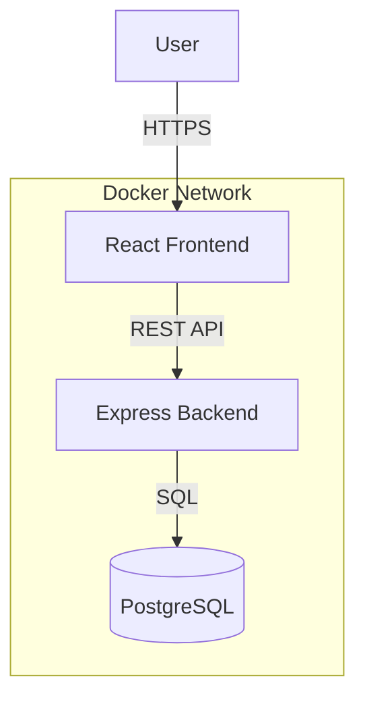

# MicroCare


**MicroCare** is an AI-powered journaling application designed to support mental wellness. It combines a modern, responsive frontend with a robust, scalable backend to provide a secure and engaging user experience.

## ✨ Key Features

-   **AI-Powered Insights**: Analyze journal entries for mood and sentiment trends.
-   **Secure Journaling**: End-to-end encrypted storage for private thoughts.
-   **Wellness Tracking**: Visualize mood over time with interactive charts.
-   **Responsive Design**: Seamless experience across desktop and mobile devices.

## 🛠️ Tech Stack

### Frontend
-   **Framework**: React (Vite)
-   **Styling**: Tailwind CSS, shadcn-ui
-   **State Management**: React-Query, Context API
-   **Language**: TypeScript

### Backend
-   **Runtime**: Node.js
-   **Framework**: Express.js
-   **Database**: PostgreSQL (via Prisma ORM)
-   **API Documentation**: Swagger/OpenAPI
-   **Language**: TypeScript

## 🏗️ Architecture



## 🚀 Quick Start

### Using Docker (Recommended)

Run the entire application stack with a single command:

```bash
docker-compose up --build
```

-   **Frontend**: http://localhost:5173
-   **Backend API**: http://localhost:3000
-   **API Docs**: http://localhost:3000/api/docs

### Manual Installation

#### Prerequisites
-   Node.js 18+
-   PostgreSQL 12+

#### 1. Backend Setup
```bash
cd backend
npm install
npm run setup   # Creates .env from example
npm run db:migrate
npm run dev
```

#### 2. Frontend Setup
```bash
cd frontend
npm install
npm run dev
```

## 📂 Project Structure

This repository is organized as a monorepo:

-   [`frontend/`](frontend/): React client application.
-   [`backend/`](backend/): Node.js API server.
-   [`docker-compose.yml`](docker-compose.yml): Service orchestration.

## � Testing & Integration

### Frontend-Backend Integration Testing

We have comprehensive integration tests to validate the frontend and backend work together:

#### Quick Test Commands
```bash
cd frontend

# Run all integration tests
./run-integration-tests.sh

# Run only API tests
./run-integration-tests.sh api

# Run only hooks tests
./run-integration-tests.sh hooks
```

#### Test Coverage
- **21 API Integration Tests**: Authentication, journal entries, user profiles
- **15 React Hooks Tests**: State management, data fetching, error handling
- **Total: 36 comprehensive tests**

#### Documentation
- [Integration Testing Guide](./frontend/INTEGRATION_TESTING.md) - Complete testing guide
- [Testing Checklist](./INTEGRATION_TESTING_CHECKLIST.md) - Manual testing checklist
- [Integration Summary](./FRONTEND_BACKEND_INTEGRATION_SUMMARY.md) - Overview and setup
- [Backend API Tests](./backend/src/e2e-*.test.ts) - Backend E2E tests

### Running Backend Tests
```bash
cd backend
npm test -- e2e-auth.test.ts
npm test -- e2e-entries.test.ts
npm test -- e2e-profile.test.ts
```

## �🤝 Contributing

We welcome contributions! Please see our [Contributing Guidelines](CONTRIBUTING.md) for details on how to get started.

## 📄 License

This project is licensed under the MIT License - see the [LICENSE](LICENSE) file for details.
